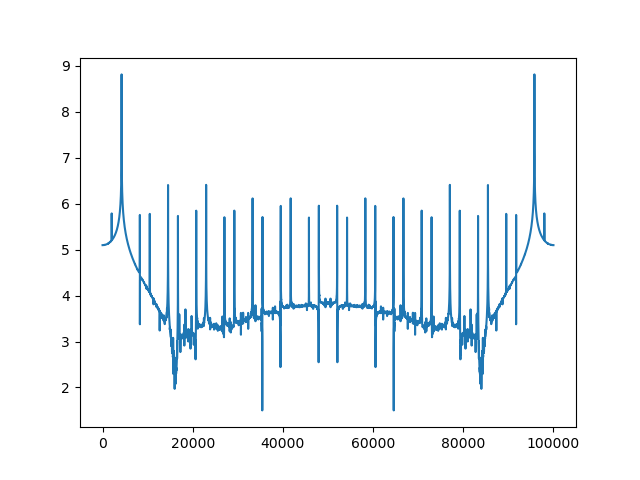
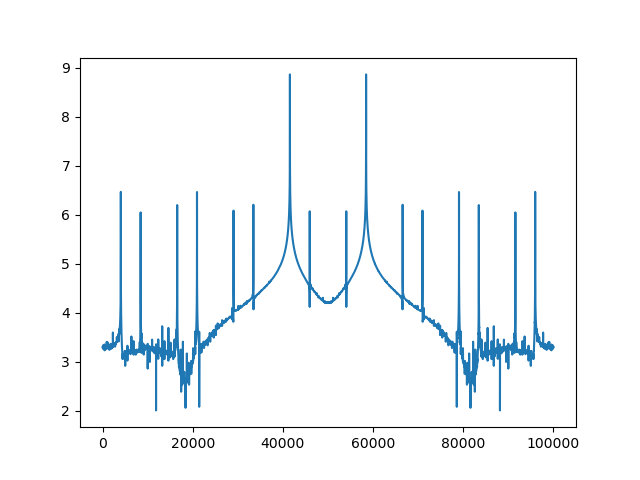

# Numerically controlled oscillator

## Sources

### Sine generator code

```verilog
module NCO (clk, rst, step, out);

parameter STEP_SIZE = 16; // integer part of of phase accumulator
parameter ADDR_WIDTH = 8; // integer part of of phase accumulator
parameter LUT_WIDTH = 16; 

localparam FRACT_WIDTH = STEP_SIZE-ADDR_WIDTH; // fractional part of phase accumulator

input clk;
input rst;
input [STEP_SIZE-1:0] step; // defines sinwave frequency
output reg signed [LUT_WIDTH-1:0] out;

reg signed [LUT_WIDTH-1:0] LUT [2**ADDR_WIDTH-1:0];
reg [STEP_SIZE+FRACT_WIDTH-1:0] ph_accum;


// RTL code for phase accumulator'

always @(posedge clk) begin
    if (rst)
        ph_accum <= 0;
    else
        ph_accum <= ph_accum + step;
end


// generate SIN LUT contents
localparam PI = $atan(1)*4.0;
// Potentially here can be troubles in 'initial'
// if yes, then generate file from other lang and use `$readmemb` or `$readmemh`

initial begin: lut_gen
real phase;
    for (phase = 0.0; phase < 2.0**ADDR_WIDTH; phase=phase+1.0) begin
       LUT[$rtoi(phase)] = (($sin(2*PI * phase / 2.0**ADDR_WIDTH)) * 2**(LUT_WIDTH-2));
    end
end

// dither generation
wire [2:0] dither; 
//assign dither = 0; // replace with line by LSFR module instantiation to get dither value
nco_dither_lsfr dither_gen (.clk(clk), .rst(rst), .out(dither));

// addr generation
reg [ADDR_WIDTH-1:0] addr;

always @(posedge clk) begin
    if (rst)
        addr <= 0;
    else
        addr <= dither + ph_accum [ADDR_WIDTH+FRACT_WIDTH-1:FRACT_WIDTH];
    
end


// LUT ouput generation from ROM
always @ (posedge clk)
	begin
		out <= LUT[addr];
	end

endmodule

```

### Dither generator (lsfr) code

```verilog
module nco_dither_lsfr (clk, rst, out);

parameter OUT_SIZE=3;
parameter LSFR_POLY='b11001001;

localparam LSFR_SIZE=$clog2(LSFR_POLY);

input clk;
input rst; 
output [OUT_SIZE-1:0] out;

reg [LSFR_SIZE-1:0] lsfr;

assign out = lsfr[LSFR_SIZE-1:LSFR_SIZE-OUT_SIZE];

wire lsfr_next;

// below line with default parameters is equivalent to
// lsfr_next = lsfr [5] ^ lsfr[4] ^ lsfr[1] ^ lsfr[0];
assign lsfr_next = ^(lsfr & LSFR_POLY);

always @(posedge clk) begin
    if (rst) begin
	    lsfr <= 'b01;
	end
	else
	begin
		lsfr <= {lsfr[LSFR_SIZE-2:0], lsfr_next};
		// above line equvivalent to below 2 lines
		// lsfr[LSFR_SIZE-1:1] <= lsfr[LSFR_SIZE-2:0];
		// lsfr[0] <= lsfr_next;
	end
end
endmodule

```

### Cocotb testbench

```python
import cocotb
from cocotb.clock import Clock
from cocotb.triggers import FallingEdge, Timer

import numpy as np


@cocotb.test()
async def nco_tb(dut):
    cocotb.start_soon(Clock(dut.clk, 1, units="ns").start())

    dut.step.value = 10

    dut.rst.value = 1
    await Timer(100, units="ns")
    dut.rst.value = 0

    sin_log = np.zeros(10000, dtype=np.int64)
    for i in range(len(sin_log)):
        await FallingEdge(dut.clk)
        if 'x' not in dut.out.value.binstr and 'z' not in dut.out.value.binstr:
            sin_log[i] = dut.out.value.signed_integer

    print(sin_log)
    sin_log.tofile('sine.dat')
    return

```

### Makefile

```
SIM = icarus
TOPLEVEL_LANG = verilog

VERILOG_SOURCES = nco_dither_lsfr.v NCO.v

TOPLEVEL = NCO

MODULE = tb

include $(shell cocotb-config --makefiles)/Makefile.sim

```

## Simulation results

### Sine generation


### Spectrums

2 dither bits

#### step = 30000




#### step = 60000



