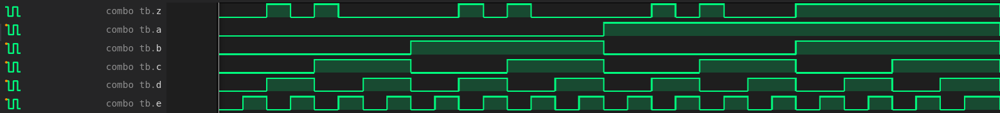
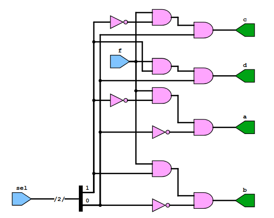

# Работа по процедурным присваиваниям

## Combinatorial logic

### Code 

```verilog

module combo (input a, b, c, d, e, output reg z);

    always @ (a or b or c or d or e) begin
        z = ((a & b) | (c ^ d) & ~e);
    end

endmodule

```

### Testbench

```verilog

`include "combo.v"

module combo_tb;
	reg a, b, c, d, e;
	wire z;
	integer i;
	combo u0 ( .a(a), .b(b), .c(c), .d(d), .e(e), .z(z));
	initial begin
		$dumpfile ("combo_tb.vcd");
		$dumpvars;
		a <= 0;
		b <= 0;
		c <= 0;
		d <= 0;
		e <= 0;
		// $monitor ("a=%0b b=%0b c=%0b d=%0b e=%0b z=%0b", a, b, c, d, e, z);
		for (i = 0; i < 32; i = i + 1) begin
			{a, b, c, d, e} = i;
			#10;
		end
	#5 $finish;
end
endmodule

```

### Schematic 


### Simulation results




## Half adder

### Code 

```verilog

module halfadd ( input a, b, output reg sum, cout);
	always @ (a or b) begin
		{cout, sum} = a + b;
	end
endmodule

```

### Testbench

```verilog
`include "ha.v"

module tb;
  reg a, b;
  wire sum, cout;
  integer i;
  halfadd u0 ( .a(a), .b(b), .sum(sum), .cout(cout));
  initial
  begin
    $dumpfile("ha_tb.vcd");
    $dumpvars;
    a <= 0;
    b <= 0;
    $monitor("a=%0b b=%0b sum=%0b cout=%0b", a, b, sum, cout);
    for (i = 0; i < 4; i = i + 1)
    begin
      {a, b} = i;
      #10;
    end
  end
endmodule

```

### Schematic 


### Simulation results


## Full adder

### Code 

```verilog

module adder ( input a, b, cin, output reg sum, cout);
	always @ (a or b or cin) begin
		{cout, sum} = a + b + cin;
	end
endmodule

```

### Testbench

```verilog

`include "adder.v"

module tb;
	reg a, b, cin;
	wire sum, cout;
	integer i;
	adder u0 ( .a(a), .b(b), .cin(cin), .sum(sum), .cout(cout));
	initial begin
		$dumpfile("adder_tb.vcd");
		$dumpvars;
		a <= 0;
		b <= 0;
		$monitor("a=%0b b=%0b cin=%0b cout=%0b sum=%0b", a, b, cin, cout, sum);
		for (i = 0; i < 8; i = i + 1) begin
			{a, b, cin} = i;
			#10;
		end
	end
endmodule

```

### Schematic 


### Simulation results


## 2x1 multiplexer

### Code 

```verilog

module mux21 (input a, b, sel, output reg c);
  always @ ( a or b or sel)
  begin
    c = sel ? a : b;
  end
endmodule

```

### Testbench

```verilog

`include "mux21.v"

module tb;
  reg a, b, sel;
  wire c;
  integer i;
  mux21 u0 ( .a(a), .b(b), .sel(sel), .c(c));
  initial
  begin
    $dumpfile("build/mux21_tb.vcd");
    $dumpvars;
    a <= 0;
    b <= 0;
    sel <= 0;
    $monitor("a=%0b b=%0b sel=%0b c=%0b", a, b, sel, c);
    for (i = 0; i < 6; i = i + 1)
    begin
      {a, b, sel} = i;
      #10;
    end
  end
endmodule


```

### Schematic 


### Simulation results


## 1x4 demultiplexer

### Code 

```verilog

module demux14 ( input f, input [1:0] sel, output reg a, b, c, d);
  always @ ( f or sel)
  begin
    a = f & ~sel[1] & ~sel[0];
    b = f & sel[1] & ~sel[0];
    c = f & ~sel[1] & sel[0];
    d = f & sel[1] & sel[0];
  end
endmodule

```

### Testbench

```verilog

`include "demux14.v"

module tb;
  reg f;
  reg [1:0] sel;
  wire a, b, c, d;
  integer i;
  demux14 u0 (.f(f), .sel(sel), .a(a), .b(b), .c(c), .d(d));
  initial
  begin
    $dumpfile("build/demux14_tb.vcd");
    $dumpvars;
    f <= 0;
    sel <= 0;
    $monitor("f=%0b sel=%0b a=%0b b=%0b c=%0b d=%0b", f, sel, a, b, c, d);
    for (i = 0; i < 8; i = i + 1)
    begin
      {f, sel} = i;
      #10;
    end
  end
endmodule

```

### Schematic 



### Simulation results


## 4x16 decoder

### Code 

```verilog

module decod4x16 ( input en, input [3:0] in, output reg [15:0] out);
	always @ (en or in) begin
		out = en ? 1 << in: 0;
	end
endmodule

```

### Testbench

```verilog

`include "decod4x16.v"

module tb;
	reg en;
	reg [3:0] in;
	wire [15:0] out;
	integer i;
	decod4x16 u0 ( .en(en), .in(in), .out(out));
	initial begin
		$dumpfile("build/decod4x16.vcd");
		$dumpvars;
		en <= 0;
		in <= 0;
		$monitor("en=%0b in=0x%0h out=0x%0h", en, in, out);
		for (i = 0; i < 32; i = i + 1) begin
			{en, in} = i;
			#10;
		end
	end
endmodule
```

### Schematic 


### Simulation results


## JK flip flop

### Code 

```verilog

module jk_flip_flop ( input j, // Input J
                        input k, // Input K
                        input rstn, // Active-low async reset
                        input clk, // Input clk
                        output reg q); // Output Q
  always @ (posedge clk or negedge rstn)
  begin
    if (!rstn)
    begin
      q <= 0;
    end
    else
    begin
      q <= (j & ~q) | (~k & q);
    end
  end
endmodule

```

### Testbench

```verilog

`include "jk.v"

module tb;
	reg j, k, rstn, clk;
	wire q;
	integer i;
	reg [2:0] dly;
	always #10 clk = ~clk;
	jk_flip_flop u0 (.j(j), .k(k), .clk(clk), .rstn(rstn), .q(q));
	initial begin
		$dumpfile("build/jk_filp_flop.vcd");
		$dumpvars;
		{j, k, rstn, clk} <= 0;
		#10 rstn <= 1;
		for (i = 0; i < 10; i = i+1) begin
			dly = $random;
			#(dly) j <= $random;
			#(dly) k <= $random;
		end
		#20 $finish;
	end
endmodule

```

### Schematic 


### Simulation results


## Mod 10 counter

### Code 

```verilog

module mod10_count ( input clk,
                       input rstn,
                       output reg[3:0] out);

  always @ (posedge clk)
  begin
    if (!rstn)
    begin
      out <= 0;
    end
    else
    begin
      if (out == 10)
        out <= 0;
      else
        out <= out + 1;
    end
  end
endmodule

```

### Testbench

```verilog

`include "mod10_count.v"

module tb;
	reg clk, rstn;
	wire [3:0] out;
	mod10_count u0 ( .clk(clk), .rstn(rstn), .out(out));
	always #10 clk = ~clk;
	initial begin
		$dumpfile("build/mod10_count.vcd");
		$dumpvars;
		{clk, rstn} <= 0;
		#10 rstn <= 1;
		#450 $finish;
	end
endmodule

```

### Schematic 


### Simulation results


## 4 bit left shift register

### Code 

```verilog

module lshift4b(input d,
                       input clk,
                       input rstn,
                       output reg [3:0] out);
  always @ (posedge clk)
  begin
    if (!rstn)
    begin
      out <= 0;
    end
    else
    begin
      out <= {out[2:0], d};
    end
  end
endmodule

```

### Testbench

```verilog

`include "lshift4b.v"

module tb;
  reg clk, rstn, d;
  wire [3:0] out;
  integer i;
  lshift4b u0 ( .d(d), .clk(clk), .rstn(rstn), .out(out));
  always #10 clk = ~clk;
  initial
  begin
    $dumpfile("build/lshift4b.vcd");
    $dumpvars;
    {clk, rstn, d} <= 0;
    #10 rstn <= 1;
    for (i = 0; i < 20; i=i+1)
    begin
      @(posedge clk) d <= $random;
    end
    #10 $finish;
  end
endmodule

```

### Schematic 


### Simulation results


