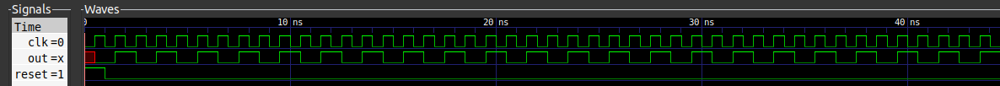

# Cocotb quickstart example

## Verilog module

```verilog
module quickstart_module(out, clk, reset);

output reg out;
input wire clk, reset;

always @ (posedge clk)
    if (reset)
        out <= 0;
    else
        out <= ~out;

endmodule
```

## Python testbench

```python
import cocotb
from cocotb.triggers import Timer


@cocotb.test()
async def my_first_test(dut):
    dut.reset.value = 1
    dut.clk.value = 0
    await Timer(0.5, units="ns")
    dut.clk.value = 1
    await Timer(0.5, units="ns")
    dut.reset.value = 0

    out_val = False

    for cycle in range(100):
        assert bool(dut.out.value) == out_val
        out_val = not out_val
        dut.clk.value = 0
        await Timer(0.5, units="ns")
        dut.clk.value = 1
        await Timer(0.5, units="ns")

```

## Test output


